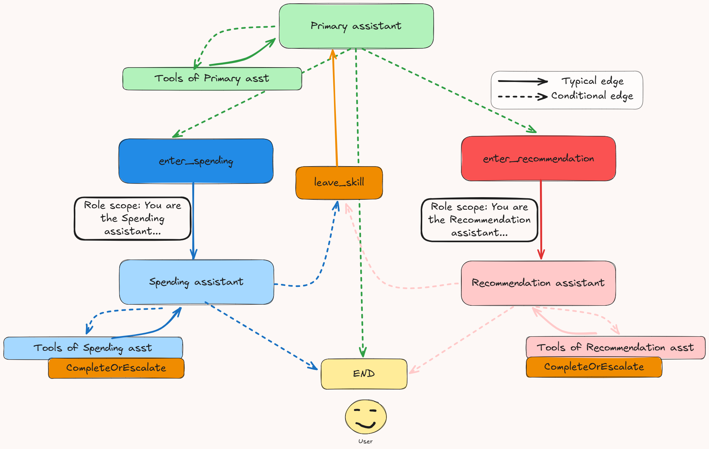

# Chatbot POC

A proof of concept chatbot application built with LangChain and OpenAI.

## Description

This project provides a simple chatbot proof of concept using LangChain and OpenAI's models.

### Graph architecture



## Prerequisites

- Python 3.11 or higher
- OpenAI API key (set in `.env` file)

## Installation

1. Clone the repository
   ```
   git clone <repository-url>
   cd chatbot-poc
   ```

2. Set up environment variables
   ```
   cp .env.example .env
   ```
   Then edit the `.env` file to add your OpenAI API key.

3. Install dependencies using one of these methods:

   **Option 1: Using setup script (Unix/macOS)**
   ```
   ./setup.sh
   ```
   This script creates a virtual environment, activates it, and installs dependencies.

   **Option 2: Manual installation**
   ```
   # Create and activate virtual environment
   python -m venv .venv
   source .venv/bin/activate
   
   # Using uv (recommended)
   uv pip install -e .
   
   # Or using pip
   pip install -e .
   ```

## Usage

Run the application:

```
python -m src.main
```

## Development

### Install Development Dependencies

For development, install with the dev extras to include Ruff:

```
pip install -e ".[dev]"
```
or 
```
uv pip install -e ".[dev]"
```

### Linting

The project uses Ruff for linting and formatting:

```
ruff check .   # Run linting
ruff format .  # Run formatting
```
